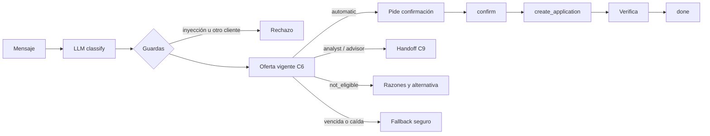

# backend/

**Dueño: Edwin (AI Engineer).**

API, orquestador (máquina de estados con LLM), servicio de política sintética, tools con permisos, guardrails, handoffs y tracing.

## Primeras entregas

- Reglas v0 de la política (borrador en [[trabajo_en_paralelo]], momento 3).
- API HTTP real sobre el orquestador (ver abajo). Endpoints en [[trabajo_en_paralelo]], momento 4.

## Reglas

- El LLM nunca produce ni modifica una decisión de política.
- El `customer_id` sale del token de sesión, nunca del texto del chat.
- Toda acción requiere confirmación explícita del cliente y se verifica antes de reportarla.
- Al reemplazar el stub por la lógica real, la forma de las respuestas no cambia.

## Política de elegibilidad (C7)

`policy/engine.py`: `RulesPolicy` cumple `EligibilityPolicy` de `radia.contracts.policy`. Función pura: misma entrada, misma decisión.
`policy/rules_v0.yaml`: bandas, topes, matriz y umbrales. `policy/rules.py` lo valida al cargar.

```python
from radia.backend.policy.engine import RulesPolicy

decision = RulesPolicy().decide(policy_input)
```

Orden de las reglas:

1. Exclusiones: cliente no activo o mora vigente > 30 días. No elegible y sin cupo. Si pide humano o disputa, va al asesor (sin cupo).
2. Exposición: la del producto. Un monto pedido sobre el tope la sube un nivel. Nunca la baja.
3. Nivel base: matriz banda × exposición. Sin puntaje, analista (`missing_data`).
4. Excepciones: al analista (ingreso nulo, zona gris, ingreso declarado distinto, riesgo alto) y al asesor (pide humano, disputa, Premium con exposición media o alta). Solo suben el nivel.
5. Cupo: predicción recortada al tope del producto. Sin predicción, automático pasa a analista.
6. No elegible: sin cupo, con alternativa de menor exposición si la matriz la permite.

Números provisionales: todos los del YAML son checkpoint de Pablo, sin aprobar. Ver [[propuesta]], sección 4.

## Orquestador de conversación

`agent/`: máquina de estados por sesión. Casos que demuestra: [[propuesta]], sección 6.

| Archivo | Qué hace |
| --- | --- |
| `llm.py` | `LanguageModel`: `classify` (entiende) y `render` (redacta con hechos dados). `FakeLanguageModel` por reglas (es, pt) y `GroqLanguageModel` |
| `session.py` | Sesión y estados: idle → awaiting_confirmation → done / handoff |
| `tools.py` | Tools con permisos, reintentos acotados y fuentes inyectables |
| `orchestrator.py` | `start_session`, `handle_message`, `confirm` |
| `tracing.py` | Sinks del `TurnTrace` (C11): en memoria y JSONL |

```python
from radia.backend.agent.llm import FakeLanguageModel
from radia.backend.agent.orchestrator import Orchestrator
from radia.backend.agent.session import Currency
from radia.backend.agent.tools import InMemoryOfferRepository, ToolBox
from radia.backend.agent.tracing import JsonlTraceSink
from radia.config import get_settings

tools = ToolBox(InMemoryOfferRepository(active_offers_df))  # C6
orch = Orchestrator(
    FakeLanguageModel(), tools, JsonlTraceSink.from_settings(get_settings())
)
# El id sale del login. Moneda y tasa a USD (USD por unidad local), del servidor.
session = orch.start_session("DEMO000001", currency=Currency.MXN, usd_per_unit=0.055)
reply = orch.handle_message(session.session_id, "Quiero una tarjeta básica")
orch.confirm(
    session.session_id, reply.pending_confirmation.confirmation_id, accept=True
)
```

Flujo:



- La decisión sale siempre de C6 (política C7). El LLM nunca decide ni calcula montos.
- Ambiguo: pide aclaración. No soportado: indica el canal.
- Ingreso declarado en el chat ("gano X", "mi ingreso es X"): pregunta abierta para el analista. La decisión adjunta no cambia. Mencionar ingresos sin monto sigue el intent normal.
- Ese camino solo aplica con intents de crédito (ofertas, pedir producto, requisitos, por qué no) o ambiguo ("gano X" a secas). Un tema no soportado sigue su redirección.
- El ingreso declarado nunca cuenta como monto pedido (modelo falso y Groq).
- Pedir humano o disputar: handoff al asesor, aunque mencione el sueldo.
- Montos del chat: en moneda local salvo que digan USD o dólares. Se convierten con la tasa de la sesión antes de compararlos con cupos en USD. Sin tasa, no enrutan: van como pregunta abierta. El analista ve la moneda original.
- Monto ambiguo (fechas, varios números, formatos raros): se ignora, nunca se adivina.
- Un número solo es monto con contexto de dinero: `$`, moneda (pesos, USD, MXN…), "mil", "millones", "monto", "cupo de", "por" o verbo de ingreso. "12 meses", "2 tarjetas" o "15%" no son montos.
- Monto concedido: se trunca a centavos antes de mostrarlo y registrarlo. Bajo 1.000 USD se muestra con 2 decimales. Lo confirmado y lo guardado coinciden.
- Monto convertido menor a 1 USD: no se ofrece, se pide aclaración.
- Automático con monto menor al cupo: se confirma y registra el monto pedido, también bajo el mínimo de negociación (menos exposición que lo aprobado). Automático sin cupo: fallback al analista.
- Pedido de crédito junto a un tema no soportado ("perdí mi empleo, quiero un préstamo"): gana el crédito.
- Sesión en handoff: respuesta fija, sin llamar al LLM ni cambiar el idioma.
- Sesiones vencidas: responden "venció" durante `evict_after` y luego se expulsan en el siguiente acceso.
- El diccionario de sesiones se protege con un lock: crear, leer y expulsar son seguros entre hilos.
- Cada sesión tiene su lock. Cubre todo el turno (mensaje o confirmación). Dos clics simultáneos en "Sí" crean una sola solicitud: el segundo ve la confirmación ya consumida.
- Orden de locks: el del diccionario solo para buscar la sesión y se suelta; luego el de la sesión. Sin deadlocks.

Permisos (en `tools.py`, fuera del LLM):

- Toda tool recibe la sesión. Otro `customer_id` se deniega (`customer_mismatch`). Sesión vencida también.
- `create_application` exige confirmación aceptada, oferta propia, vigente y automática.
- Idempotente por `confirmation_id`: un reintento no duplica la solicitud.
- Una solicitud por oferta y cliente. Otra con distinta confirmación se deniega (`application_exists`), no se devuelve la existente: no se reporta como nueva una acción que no ocurrió.
- El orquestador revisa antes (`find_application`): si ya existe, informa la referencia y no pide confirmar.
- Si esa búsqueda cae y al confirmar la tool deniega `application_exists`, se informa la existente (la denegación trae su referencia). No hay handoff.
- Chequeo y alta en una sola sección crítica del store (`create_if_absent`, con lock): confirmaciones concurrentes no duplican.
- Registra el monto confirmado, nunca más que el cupo (`amount_above_offer`).
- Cada turno pasa su propio recolector de `ToolCall`: turnos concurrentes no mezclan trazas.

Fallback:

- Reintentos acotados con tenacity (3 intentos) solo en fallas técnicas. Una denegación no se reintenta.
- Ofertas vencidas o fuente caída: nunca se inventa una oferta. En consultas, se pide reintentar. En acciones, handoff al analista con preguntas abiertas.
- Solicitud no verificada: no se reporta. Handoff con la acción intentada.
- Si ni el handoff se puede crear, se descarta la confirmación pendiente y la sesión vuelve a idle.

Tracing:

- Cada turno (mensaje o confirmación) escribe un `TurnTrace` (C11): intent, tools, comportamientos, nivel, reglas, fuentes, versiones, tokens, costo y latencia.
- Tokens y costo del turno: suma de su propio recolector de `Usage` (una entrada por llamada al LLM). El acumulado global de `GroqLanguageModel` se protege con un lock.
- Sin texto del cliente. JSONL en `data_dir/traces/`, un archivo por día.
- El error de una tool guarda solo el tipo de la excepción, nunca su mensaje.

LLM real: `GroqLanguageModel` lee `GROQ_API_KEY` del archivo de entorno (ver `.env.example`). Usarlo es gasto: checkpoint de Pablo. Tests y demo usan `FakeLanguageModel`; un fixture de los tests hace fallar cualquier `groq.Groq` real.

Guardas del LLM real:

- `classify`: emails, teléfonos y secuencias de 6 o más dígitos salen enmascarados. Historial y mensaje van como datos, nunca como instrucciones. Un campo inválido se degrada solo; la sospecha de inyección se conserva.
- `render`: las plantillas de confirmación, acción y handoff salen tal cual. En las demás, se descarta la reescritura si agrega números o palabras de aprobación o registro.

## API HTTP (C8)

`api/`: app FastAPI sobre el orquestador. Contrato en `radia.contracts.api`. Endpoints de [[trabajo_en_paralelo]], momento 4.

```bash
uv run uvicorn radia.backend.api.main:app --reload --port 8000
# Documentación interactiva: http://localhost:8000/docs
```

| Endpoint | Rol | Qué hace |
| --- | --- | --- |
| `POST /auth/login` | todos | Devuelve un token opaco atado al rol y al cliente |
| `GET /customers/me/offers` | cliente | Ofertas vigentes de C6 y la destacada. Sin rango de negociación |
| `POST /chat/messages` | cliente | Mensaje al orquestador. Sin `session_id`, abre sesión |
| `POST /chat/confirm` | cliente | Botón Sí o No de la acción pendiente |
| `GET /analyst/cases` | analista | Casos C9 de revisión, pendientes o con información pedida |
| `POST /analyst/cases/{case_id}/decision` | analista | Aprobar, rechazar o pedir información |
| `GET /advisor/sessions` | asesor | Casos C9 traspasados al asesor, con sus mensajes |
| `POST /advisor/sessions/{case_id}/messages` | asesor | Mensaje con monto propuesto dentro del rango |

Credenciales de DEMO. Públicas a propósito: NO son reales ni secretas.

| Usuario | Clave | Rol |
| --- | --- | --- |
| `DEMO000001` ... `DEMO000018` | `radia-demo` | cliente demo (ver `eval/demo_customers.py`) |
| `analyst.demo` | `radia-demo` | analista |
| `advisor.demo` | `radia-demo` | asesor |

Reglas:

- Cabecera `Authorization: Bearer <token>`. Sin token válido, 401. Rol ajeno, 403.
- La identidad sale del token. El cuerpo nunca trae `customer_id`.
- El lock global de la API solo cubre el dueño de la sesión y su alta. El turno lo serializa el lock de la sesión: clientes distintos conversan en paralelo.
- La sesión de chat es de quien la abrió. Otro cliente sobre ella recibe 404, igual que una inexistente.
- Aprobar un caso `analyst_and_advisor` abre un caso de asesor con el mismo expediente. Su `trigger_reason` es `analyst_approved:<case_id del analista>`.
- Monto del asesor fuera del rango de negociación del caso: 422. Caso ya decidido: 409.
- Ofertas: `demo_offers()` siempre, más `data_dir/gold/active_offers.parquet` si existe. Un id repetido queda con el de Gold. Solo los clientes demo hacen login; el login con clientes de Gold queda para después de la descarga.
- Moneda de la sesión según el país del cliente demo. Tasas aproximadas y provisionales (`api/state.py`).
- LLM: `FakeLanguageModel`. Groq solo con `USE_GROQ=true` (gasto: checkpoint de Pablo).
- Traces JSONL en `data_dir/traces/`.
- Tokens, sesiones, casos y mensajes viven en memoria: se pierden al reiniciar.

Detalle en [[propuesta]] y [[trabajo_en_paralelo]].
