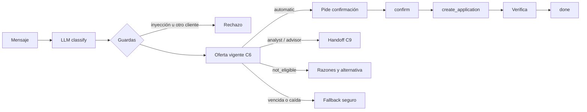

# backend/

**Dueño: Edwin (AI Engineer).**

API, orquestador (máquina de estados con LLM), servicio de política sintética, tools con permisos, guardrails, handoffs y tracing.

## Primeras entregas

- Reglas v0 de la política (borrador en [[trabajo_en_paralelo]], momento 3).
- Stub de la API con respuestas fijas, para que el frontend avance desde el D1 (endpoints en [[trabajo_en_paralelo]], momento 4).

## Reglas

- El LLM nunca produce ni modifica una decisión de política.
- El `customer_id` sale del token de sesión, nunca del texto del chat.
- Toda acción requiere confirmación explícita del cliente y se verifica antes de reportarla.
- Al reemplazar el stub por la lógica real, la forma de las respuestas no cambia.

## Política de elegibilidad (C7)

`policy/engine.py`: `RulesPolicy` cumple `EligibilityPolicy` de `radia.contracts.policy`. Función pura: misma entrada, misma decisión.
`policy/rules_v0.yaml`: bandas, topes, matriz y umbrales. `policy/rules.py` lo valida al cargar.

```python
from radia.backend.policy.engine import RulesPolicy

decision = RulesPolicy().decide(policy_input)
```

Orden de las reglas:

1. Exclusiones: cliente no activo o mora vigente > 30 días. No elegible y sin cupo. Si pide humano o disputa, va al asesor (sin cupo).
2. Exposición: la del producto. Un monto pedido sobre el tope la sube un nivel. Nunca la baja.
3. Nivel base: matriz banda × exposición. Sin puntaje, analista (`missing_data`).
4. Excepciones: al analista (ingreso nulo, zona gris, ingreso declarado distinto, riesgo alto) y al asesor (pide humano, disputa, Premium con exposición media o alta). Solo suben el nivel.
5. Cupo: predicción recortada al tope del producto. Sin predicción, automático pasa a analista.
6. No elegible: sin cupo, con alternativa de menor exposición si la matriz la permite.

Números provisionales: todos los del YAML son checkpoint de Pablo, sin aprobar. Ver [[propuesta]], sección 4.

## Orquestador de conversación

`agent/`: máquina de estados por sesión. Casos que demuestra: [[propuesta]], sección 6.

| Archivo | Qué hace |
| --- | --- |
| `llm.py` | `LanguageModel`: `classify` (entiende) y `render` (redacta con hechos dados). `FakeLanguageModel` por reglas (es, pt) y `GroqLanguageModel` |
| `session.py` | Sesión y estados: idle → awaiting_confirmation → done / handoff |
| `tools.py` | Tools con permisos, reintentos acotados y fuentes inyectables |
| `orchestrator.py` | `start_session`, `handle_message`, `confirm` |
| `tracing.py` | Sinks del `TurnTrace` (C11): en memoria y JSONL |

```python
from radia.backend.agent.llm import FakeLanguageModel
from radia.backend.agent.orchestrator import Orchestrator
from radia.backend.agent.tools import InMemoryOfferRepository, ToolBox
from radia.backend.agent.tracing import JsonlTraceSink
from radia.config import get_settings

tools = ToolBox(InMemoryOfferRepository(active_offers_df))  # C6
orch = Orchestrator(
    FakeLanguageModel(), tools, JsonlTraceSink.from_settings(get_settings())
)
session = orch.start_session("DEMO000001")  # el id sale del login
reply = orch.handle_message(session.session_id, "Quiero una tarjeta básica")
orch.confirm(
    session.session_id, reply.pending_confirmation.confirmation_id, accept=True
)
```

Flujo:



- La decisión sale siempre de C6 (política C7). El LLM nunca decide ni calcula montos.
- Ambiguo: pide aclaración. No soportado: indica el canal.
- Ingreso declarado en el chat: pregunta abierta para el analista. La decisión adjunta no cambia.
- Pedir humano o disputar: handoff al asesor.

Permisos (en `tools.py`, fuera del LLM):

- Toda tool recibe la sesión. Otro `customer_id` se deniega (`customer_mismatch`). Sesión vencida también.
- `create_application` exige confirmación aceptada, oferta propia, vigente y automática.
- Idempotente por `confirmation_id`: un reintento no duplica la solicitud.

Fallback:

- Reintentos acotados con tenacity (3 intentos) solo en fallas técnicas. Una denegación no se reintenta.
- Ofertas vencidas o fuente caída: nunca se inventa una oferta. En consultas, se pide reintentar. En acciones, handoff al analista con preguntas abiertas.
- Solicitud no verificada: no se reporta. Handoff con la acción intentada.

Tracing:

- Cada turno (mensaje o confirmación) escribe un `TurnTrace` (C11): intent, tools, comportamientos, nivel, reglas, fuentes, versiones, tokens, costo y latencia.
- Sin texto del cliente. JSONL en `data_dir/traces/`, un archivo por día.

LLM real: `GroqLanguageModel` lee `GROQ_API_KEY` del archivo de entorno (ver `.env.example`). Usarlo es gasto: checkpoint de Pablo. Tests y demo usan `FakeLanguageModel`.

Detalle en [[propuesta]] y [[trabajo_en_paralelo]].
